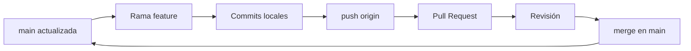

# Control de versiones con Git y GitHub

### Guía práctica para alumnos de Infraestructura IT (desde cero hasta nivel intermedio-avanzado)

---

## Introducción

En infraestructura no solo administras servidores, redes o contenedores: también **documentas**, **automatizas** y **compartes** configuraciones (scripts Bash, playbooks Ansible, manifiestos Kubernetes, plantillas Terraform, inventarios, diagramas). Sin un sistema de control de versiones es fácil perder el hilo de quién cambió qué, cuándo y por qué — y mucho más grave: **sobrescribir** una configuración que funcionaba en producción.

**Git** es el estándar de facto para versionar archivos de texto (código, configs, documentación). **GitHub** (u GitLab, Bitbucket, Gitea…) es la plataforma donde se aloja el repositorio remoto, se revisan cambios y se colabora en equipo.

| Área en infraestructura | Uso típico de Git |
|-------------------------|-------------------|
| Automatización | Scripts, roles Ansible, pipelines CI/CD |
| Infraestructura como código (IaC) | Terraform, Pulumi, CloudFormation |
| Contenedores y orquestación | Dockerfiles, Helm charts, manifiestos YAML |
| Redes y sistemas | Backups de `running-config`, plantillas, inventarios |
| Documentación | Runbooks, procedimientos, este tipo de guías |

**Metodología recomendada en cada caso:**

1. Lee el **objetivo** y los **conceptos** antes de ejecutar comandos.
2. Ejecuta los pasos en orden; no saltes la verificación (**✅ Comprobación**).
3. Anota en tu cuaderno de laboratorio: comando, salida esperada y resultado obtenido.
4. Si algo falla, consulta **Troubleshooting** y **Preguntas frecuentes** antes de pedir ayuda.
5. Al terminar un bloque, haz un repaso con la **Chuleta de comandos**.

---

## Requisitos previos

### Conocimientos

| Tema | Nivel mínimo |
|------|----------------|
| Sistema operativo | Navegar por carpetas, crear/editar archivos, usar terminal |
| Línea de comandos | `cd`, `ls`, `mkdir`, `cat`, redirección (`>`, `>>`) |
| Redes (recomendado) | Saber qué es HTTPS y SSH; concepto de cliente/servidor |
| Inglés técnico | Los mensajes de Git y la documentación oficial están en inglés |

No necesitas saber programar para empezar: Git versiona **cualquier archivo de texto**, incluidos `.md`, `.yml`, `.cfg` o `.sh`.

### Software y cuentas

| Requisito | Detalle |
|-----------|---------|
| Sistema operativo | **Linux** (recomendado en aula), **macOS**, o **Windows** con **WSL2** (Ubuntu) |
| Git | Versión **2.30 o superior** (`git --version`) |
| Cuenta GitHub | Gratuita en [https://github.com/signup](https://github.com/signup) |
| Editor de texto | VS Code, Vim, Nano o el que uses en laboratorio |
| Navegador | Para crear repos, Pull Requests y revisar historial en la web |

### Instalación de Git

#### Linux (Debian/Ubuntu)

```bash
sudo apt update
sudo apt install -y git
git --version
```

#### Linux (Fedora/RHEL)

```bash
sudo dnf install -y git
git --version
```

#### Windows (WSL2 — recomendado en aula)

1. Instala WSL2 y una distro Ubuntu desde Microsoft Store o `wsl --install`.
2. Abre la terminal Ubuntu y ejecuta los comandos de Debian/Ubuntu anteriores.
3. Trabaja siempre **dentro de WSL** (`/home/usuario/...`), no en `C:\` montado con permisos raros, salvo que sepas lo que haces.

#### macOS

```bash
# Con Homebrew (si lo tienes)
brew install git
git --version
```

### Configuración inicial obligatoria

Git asocia cada commit a un **nombre** y un **correo**. Usa el mismo correo que en GitHub si quieres que tus contribuciones aparezcan en tu perfil.

```bash
git config --global user.name "Nombre Apellido"
git config --global user.email "tu_correo@ejemplo.com"
```

Comprobación:

```bash
git config --global --list
```

### Configuración recomendada para el curso

```bash
# Rama por defecto al crear repos nuevos (estándar actual)
git config --global init.defaultBranch main

# Colores y ayudas en terminal
git config --global color.ui auto

# Editor por defecto (elige uno)
git config --global core.editor "nano"          # sencillo
# git config --global core.editor "code --wait" # VS Code

# Evitar commits accidentales en Windows/WSL con finales de línea mezclados
git config --global core.autocrlf input         # Linux/macOS/WSL
# En Windows nativo (sin WSL): git config --global core.autocrlf true
```

### Autenticación con GitHub

Para `git push` y `git pull` necesitas identificarte. Dos opciones habituales:

| Método | Cuándo usarlo | Notas |
|--------|----------------|-------|
| **HTTPS** | Primeros pasos, laboratorio rápido | GitHub ya no acepta contraseña de cuenta; usa **Personal Access Token (PAT)** como contraseña |
| **SSH** | Uso diario profesional | Par de claves `ed25519`; más cómodo sin escribir token cada vez |

#### HTTPS — crear un token (PAT)

1. GitHub → **Settings** → **Developer settings** → **Personal access tokens** → **Tokens (classic)**.
2. Genera un token con alcance `repo` (para repos privados del curso).
3. Al hacer `git push`, usuario = tu usuario de GitHub, contraseña = el **token** (guárdalo en un gestor de contraseñas; no lo subas a ningún repo).

#### SSH — configuración básica

```bash
ssh-keygen -t ed25519 -C "tu_correo@ejemplo.com"
# Acepta la ruta por defecto (~/.ssh/id_ed25519) y opcionalmente una passphrase

cat ~/.ssh/id_ed25519.pub
```

Copia la salida y añádela en GitHub → **Settings** → **SSH and GPG keys** → **New SSH key**.

Prueba la conexión:

```bash
ssh -T git@github.com
```

Si ves un mensaje de bienvenida con tu usuario, la clave funciona. Clona y empuja con URLs del tipo:

```text
git@github.com:usuario/repositorio.git
```

### Estructura mental: las tres “zonas” de Git

```text
  Directorio de trabajo          Área de preparación (staging)          Repositorio local (.git)
  (working tree)                   (index)                              (commits)
  ─────────────────                ─────────────────                    ─────────────────
  Archivos que editas    ──git add──►  Cambios listos para commit  ──git commit──►  Historial permanente
```

- **Remoto (`origin`)**: copia en GitHub; se sincroniza con `git push` / `git pull` / `git fetch`.

---

## Conceptos clave (léelos antes del Caso 1)

| Concepto | Definición breve |
|----------|------------------|
| **Repositorio (repo)** | Carpeta vigilada por Git; contiene historial en `.git/` |
| **Commit** | Instantánea versionada con mensaje, autor y fecha |
| **Rama (branch)** | Línea de desarrollo independiente (`main`, `feature/dhcp`) |
| **Merge** | Integrar el historial de una rama en otra |
| **Remoto** | Servidor (GitHub); por convención se llama `origin` |
| **Clone** | Copia completa de un repo remoto en tu máquina |
| **Fork** | Copia de un repo ajeno en tu cuenta de GitHub |
| **Pull Request (PR)** | Propuesta para que el dueño del repo integre tus cambios |
| **`.gitignore`** | Lista de archivos que Git **no** debe versionar |
| **Tag** | Etiqueta a un commit (p. ej. `v1.0`, release de un playbook) |

### Buenas prácticas en infraestructura

- **Nunca** subas contraseñas, claves privadas, `.env` con secretos ni `id_rsa` — usa `.gitignore` y variables de entorno o vaults.
- Mensajes de commit **claros**: qué cambió y por qué (`fix: corrige gateway en vlan10`, no `cambios`).
- Commits **pequeños y frecuentes**: un cambio lógico por commit.
- Antes de tocar producción, el flujo suele ser: rama → PR → revisión → merge → pipeline.

### Plantilla de `.gitignore` útil en infra

Crea o amplía `.gitignore` en tus proyectos:

```gitignore
# Secretos y entornos locales
.env
.env.*
*.pem
*.key
id_rsa*
secrets/

# Logs y temporales
*.log
*.tmp
*.swp
.DS_Store
Thumbs.db

# Terraform (estado local — el estado remoto va en backend configurado)
.terraform/
*.tfstate
*.tfstate.*

# Python / Ansible artefactos locales
__pycache__/
.venv/
*.retry

# Editores
.vscode/
.idea/
```

---

# Bloque 1 — Fundamentos (Casos 1–10)

Objetivo del bloque: instalar, configurar, crear repos, commits, remotos, clonar y ramas básicas.

---

## Caso 1: Verificar instalación y configuración

**Objetivo:** Confirmar que Git está operativo y revisar tu identidad configurada.

```bash
git --version
git config --list --show-origin
```

**✅ Comprobación:** Ves una versión ≥ 2.30 y tus `user.name` / `user.email` correctos.

---

## Caso 2: Crear un repositorio local

**Objetivo:** Inicializar un proyecto vacío bajo control de versiones.

```bash
mkdir ~/lab-git/mi_primer_repo
cd ~/lab-git/mi_primer_repo
git init
ls -la
```

**✅ Comprobación:** Existe el directorio oculto `.git/`.

---

## Caso 3: Primer archivo y primer commit

**Objetivo:** Recorrer el ciclo `status` → `add` → `commit`.

```bash
echo "# Laboratorio Git - Infraestructura IT" > README.md
git status
git add README.md
git status
git commit -m "docs: añade README inicial del laboratorio"
git log --oneline
```

**✅ Comprobación:** `git log` muestra un commit con tu nombre y el mensaje indicado.

**Tip:** `git add -p` (modo interactivo) permite elegir qué trozos de un archivo van al staging — útil en configs largas.

---

## Caso 4: Crear repositorio en GitHub y enlazar el remoto

**Objetivo:** Conectar carpeta local con repo vacío en GitHub.

1. En GitHub: **New repository** → nombre `mi_primer_repo` → **sin** README (ya lo tienes local).
2. En local:

```bash
git remote add origin git@github.com:TU_USUARIO/mi_primer_repo.git
# o HTTPS:
# git remote add origin https://github.com/TU_USUARIO/mi_primer_repo.git

git remote -v
git branch -M main
```

**✅ Comprobación:** `git remote -v` muestra `fetch` y `push` hacia tu URL.

---

## Caso 5: Subir cambios al remoto (push)

**Objetivo:** Publicar la rama `main` en GitHub.

```bash
git push -u origin main
```

**✅ Comprobación:** En el navegador ves `README.md` y el historial de commits.

El flag `-u` deja configurado el seguimiento: en adelante basta `git push` / `git pull` desde esa rama.

---

## Caso 6: Clonar un repositorio existente

**Objetivo:** Obtener una copia completa (historial incluido) de un proyecto.

```bash
cd ~/lab-git
git clone https://github.com/TU_USUARIO/mi_primer_repo.git proyecto-clonado
cd proyecto-clonado
git status
git log --oneline -5
```

**✅ Comprobación:** Carpeta `proyecto-clonado` con `.git` y mismo historial que el remoto.

En clase podéis clonar repos oficiales del centro o de un compañero (con permiso).

---

## Caso 7: Explorar el historial

**Objetivo:** Inspeccionar commits, autores y archivos tocados.

```bash
git log
git log --oneline --graph --decorate --all
git show HEAD
git show HEAD --stat
```

**✅ Comprobación:** Entiendes hash abreviado, autor, fecha y diff del último commit.

---

## Caso 8: Modificar archivos y ver diferencias

**Objetivo:** Trabajar con el directorio de trabajo y `git diff`.

```bash
echo "" >> README.md
echo "## Estado del servicio" >> README.md
git status
git diff
git add README.md
git diff --staged
git commit -m "docs: amplía README con sección de estado"
```

**✅ Comprobación:** Antes de `add` ves diff sin staged; después de `add`, `git diff --staged` muestra lo que irá al commit.

---

## Caso 9: Ramas — trabajar en paralelo

**Objetivo:** Crear una rama de feature sin tocar `main` directamente.

```bash
git checkout -b feature/inventario-servidores
# equivalente moderno: git switch -c feature/inventario-servidores

echo "servidor01,192.168.1.10" > inventario.csv
git add inventario.csv
git commit -m "feat: añade inventario inicial de servidores"

git branch
git log --oneline --graph --all
```

**✅ Comprobación:** El asterisco `*` marca la rama activa; el commit solo está en la rama feature.

---

## Caso 10: Fusionar ramas (merge)

**Objetivo:** Integrar la feature en `main`.

```bash
git checkout main
git merge feature/inventario-servidores
git log --oneline --graph
```

**✅ Comprobación:** `inventario.csv` aparece en `main`; el historial muestra el merge (o fast-forward).

Opcional — borrar rama ya fusionada:

```bash
git branch -d feature/inventario-servidores
```

---

# Bloque 2 — Intermedio (Casos 11–15)

Objetivo del bloque: conflictos, ignorar archivos, deshacer cambios, sincronizar con remoto, tags.

---

## Caso 11: Resolver un conflicto de merge

**Objetivo:** Practicar la resolución manual cuando dos ramas editan la misma línea.

```bash
git checkout -b rama-a
echo "DNS=8.8.8.8" > resolv.conf
git add resolv.conf && git commit -m "config: DNS Google en rama-a"

git checkout main
git checkout -b rama-b
echo "DNS=1.1.1.1" > resolv.conf
git add resolv.conf && git commit -m "config: DNS Cloudflare en rama-b"

git checkout main
git merge rama-a
git merge rama-b
```

Git marcará conflicto en `resolv.conf` con:

```text
<<<<<<< HEAD
...
=======
...
>>>>>>> rama-b
```

Edita el archivo dejando **una** versión válida (o combinando), luego:

```bash
git add resolv.conf
git commit -m "merge: unifica DNS tras conflicto entre ramas"
```

**✅ Comprobación:** `git status` limpio; `resolv.conf` con el contenido acordado.

---

## Caso 12: `.gitignore` y archivos no rastreados

**Objetivo:** Evitar versionar logs, secretos o artefactos generados.

```bash
echo "*.log" >> .gitignore
echo "tmp/" >> .gitignore
mkdir -p tmp
echo "dato sensible" > tmp/secreto.log
echo "info" > app.log

git status
git add .gitignore
git commit -m "chore: ignora logs y carpeta tmp"
```

**✅ Comprobación:** `app.log` y `tmp/` no aparecen como pendientes de commit (o aparecen como ignorados).

Comando útil si añadiste algo por error al índice:

```bash
git rm --cached archivo.log
```

---

## Caso 13: Deshacer y corregir errores

**Objetivo:** Conocer `restore`, `reset` y `revert` — cada uno tiene un uso distinto.

| Situación | Comando orientativo |
|-----------|---------------------|
| Descartar cambios **no** commiteados en un archivo | `git restore archivo` |
| Quitar archivo del staging | `git restore --staged archivo` |
| **Revertir** un commit ya publicado (seguro en equipo) | `git revert <hash>` |
| Deshacer último commit **local** (mantiene cambios) | `git reset --soft HEAD~1` |
| Deshacer último commit **local** (descarta cambios) | `git reset --hard HEAD~1` ⚠️ destructivo |

Ejemplo de `revert` (crea un commit nuevo que deshace otro):

```bash
git log --oneline
git revert HEAD
git log --oneline
```

**✅ Comprobación:** Historial con commit de reversión; no reescribes historia pública.

**Regla de oro:** Si ya hiciste `push` a un repo compartido, **no** uses `reset --hard` sobre commits publicados; usa `revert` o coordina con el equipo.

---

## Caso 14: Sincronizar con el remoto (fetch, pull)

**Objetivo:** Traer cambios de GitHub antes de seguir trabajando.

```bash
git fetch origin
git status
git pull origin main
```

**✅ Comprobación:** Tras un cambio hecho en la web (o por un compañero), tu copia local está actualizada.

Flujo habitual en equipo:

```bash
git checkout main
git pull
git checkout -b feature/mi-cambio
# ... trabajar, commit, push ...
```

---

## Caso 15: Etiquetas (tags) para versiones

**Objetivo:** Marcar releases (p. ej. versión estable de un script de backup).

```bash
git tag -a v1.0 -m "Primera versión estable del playbook"
git tag
git push origin v1.0
# o empujar todas las tags: git push origin --tags
```

**✅ Comprobación:** Tag `v1.0` visible en GitHub → **Releases** / pestaña **Tags**.

---

# Bloque 3 — Colaboración y nivel avanzado inicial (Casos 16–20)

Objetivo del bloque: trabajo en equipo, PRs, inspección del repo, aliases y flujos reales.

---

## Caso 16: Fork, rama, push y Pull Request

**Objetivo:** Simular contribución a un proyecto de otro (profesor o compañero).

1. En GitHub, **Fork** del repositorio original.
2. Clona **tu fork**:

```bash
git clone git@github.com:TU_USUARIO/repo-forkeado.git
cd repo-forkeado
git remote add upstream git@github.com:ORIGEN/repo-original.git
git remote -v
```

3. Crea rama, cambia y sube:

```bash
git checkout -b mejora/documentacion
# editar archivos...
git add .
git commit -m "docs: mejora sección de requisitos"
git push -u origin mejora/documentacion
```

4. En GitHub: **Compare & pull request** hacia el repo original.

**✅ Comprobación:** PR abierto, checks visibles, conversación de revisión disponible.

Mantener tu fork al día con el original:

```bash
git fetch upstream
git checkout main
git merge upstream/main
git push origin main
```

---

## Caso 17: Estado del repositorio y limpieza

**Objetivo:** Diagnóstico rápido antes de commit o push.

```bash
git status -sb
git diff
git diff --staged
git clean -n    # simula borrado de archivos no rastreados
```

**✅ Comprobación:** Interpretas `M`, `A`, `D`, `??` en salida corta.

---

## Caso 18: Autores y responsabilidad de cambios

**Objetivo:** Auditoría ligera — quién ha commitado más en el repo.

```bash
git shortlog -sn
git blame README.md
git log --follow -- README.md
```

**✅ Comprobación:** `blame` muestra autor y commit por línea (útil en configs compartidas).

---

## Caso 19: Eliminar archivos del repo y del disco

**Objetivo:** Borrado versionado (no solo borrar el fichero a mano).

```bash
echo "obsoleto" > obsoleto.cfg
git add obsoleto.cfg && git commit -m "chore: archivo temporal de prueba"
git rm obsoleto.cfg
git commit -m "chore: elimina configuración obsoleta"
git push
```

**✅ Comprobación:** El archivo desaparece en GitHub y el borrado queda en el historial.

Solo quitar del repo pero conservar en disco:

```bash
git rm --cached archivo_local.conf
```

---

## Caso 20: Aliases y productividad

**Objetivo:** Abreviar comandos que repetirás cientos de veces.

```bash
git config --global alias.st "status -sb"
git config --global alias.co checkout
git config --global alias.br branch
git config --global alias.lg "log --oneline --graph --decorate -20"
git config --global alias.unstage "restore --staged"

git st
git lg
```

**✅ Comprobación:** Los alias aparecen en `git config --global --get-regexp alias`.

---

# Extensiones recomendadas (más allá del Caso 20)

## Stash — guardar trabajo a medias

Útil cuando debes cambiar de rama urgente pero no quieres commitear WIP:

```bash
git stash push -m "WIP: mitad del script de backup"
git checkout main
git pull
git checkout -
git stash list
git stash pop
```

## Rebase interactivo (historial lineal)

Reorganiza commits **locales** antes de abrir PR (no rebase sobre ramas compartidas sin acuerdo):

```bash
git checkout feature/mi-rama
git rebase -i main
```

En el editor, `pick` / `squash` / `reword` según necesites.

## Cherry-pick — traer un commit concreto

```bash
git log --oneline otra-rama
git cherry-pick <hash>
```

## Inspeccionar un repo sin clonar (desde terminal)

```bash
git clone --depth 1 https://github.com/usuario/repo.git
```

`--depth 1` (shallow clone) ahorra tiempo en repos grandes — suficiente para leer código en laboratorio.

## GitHub CLI (`gh`) — opcional

```bash
# Instalación en Ubuntu
sudo apt install gh
gh auth login
gh repo clone usuario/repo
gh pr create
```

---

## Flujo de trabajo sugerido para prácticas y proyectos



1. `git pull` en `main`.
2. `git checkout -b feature/descripcion-corta`.
3. Cambios pequeños + commits con mensaje claro.
4. `git push -u origin feature/descripcion-corta`.
5. Abrir PR; atender comentarios; merge.
6. Borrar rama remota/local si ya no sirve.

Convención de mensajes (recomendada): **Conventional Commits**

```text
feat: añade playbook de instalación nginx
fix: corrige variable de entorno en rol db
docs: actualiza diagrama de red
chore: actualiza .gitignore
```

---

## Chuleta de comandos

| Acción | Comando |
|--------|---------|
| Ayuda | `git help <comando>` |
| Estado | `git status -sb` |
| Añadir todo | `git add .` |
| Commit | `git commit -m "mensaje"` |
| Historial compacto | `git log --oneline --graph -10` |
| Nueva rama | `git switch -c nombre` |
| Cambiar rama | `git switch nombre` |
| Merge | `git merge nombre-rama` |
| Push | `git push` |
| Pull | `git pull` |
| Clonar | `git clone <url>` |
| Remotos | `git remote -v` |
| Diff | `git diff` / `git diff --staged` |
| Descartar cambios locales | `git restore <archivo>` |
| Revertir commit publicado | `git revert <hash>` |

---

## Troubleshooting rápido

| Problema | Causa habitual | Qué hacer |
|----------|----------------|-----------|
| `permission denied (publickey)` | SSH no configurado | Revisa `ssh -T git@github.com` y clave en GitHub |
| `Authentication failed` (HTTPS) | PAT caducado o mal pegado | Genera nuevo token; no uses contraseña de la cuenta |
| `rejected (non-fast-forward)` | Remoto tiene commits que tú no | `git pull --rebase` o `git pull` y resolver |
| `Please tell me who you are` | Falta `user.name` / `user.email` | `git config --global user.name` y `user.email` |
| `fatal: not a git repository` | No estás en carpeta con `.git` | `cd` al repo o `git init` |
| Conflictos en merge | Misma línea editada en dos ramas | Editar marcadores, `git add`, `git commit` |
| Archivo enorme rechazado | Límite 100 MB en GitHub | No versionar binarios grandes; usar Git LFS o almacenamiento externo |
| Credenciales en Windows mezcladas | Git de Windows vs WSL | Usa solo WSL o solo Git for Windows, no mezclar repos |

---

## Preguntas frecuentes

**¿Git y GitHub son lo mismo?**  
No. Git es la herramienta local; GitHub es un servicio que aloja repos remotos y añade PRs, issues, Actions, etc.

**¿Puedo usar Git sin Internet?**  
Sí. Commits, ramas y merges funcionan offline. Necesitas red para `clone`, `push` y `pull`.

**¿Qué rama uso: `main` o `master`?**  
Hoy el estándar es `main`. Repos antiguos pueden usar `master`; comprueba con `git branch`.

**¿Subo mis scripts de examen a un repo público?**  
Evita público si es evaluable; respeta la política del centro. Nunca subas datos personales de clientes reales.

**¿Y si borro algo importante?**  
`git reflog` muestra movimientos recientes de `HEAD`; a menudo puedes recuperar commits “perdidos” antes de que expire el garbage collection.

```bash
git reflog
git checkout -b recuperacion abc1234
```

---

## Recursos oficiales y para seguir practicando

| Recurso | Enlace |
|---------|--------|
| Documentación Pro Git (español) | [https://git-scm.com/book/es/v2](https://git-scm.com/book/es/v2) |
| GitHub Docs — Git | [https://docs.github.com/es/get-started/using-git](https://docs.github.com/es/get-started/using-git) |
| GitHub Skills (labs interactivos) | [https://skills.github.com/](https://skills.github.com/) |
| Learn Git Branching (visual) | [https://learngitbranching.js.org/?locale=es_ES](https://learngitbranching.js.org/?locale=es_ES) |
| Git Cheat Sheet (GitHub) | [https://education.github.com/git-cheat-sheet-education.pdf](https://education.github.com/git-cheat-sheet-education.pdf) |

**Práctica autónoma sugerida:**

1. Versiona un script Bash de backup o un inventario Ansible del curso.
2. Crea un repo **privado** con un playbook y un `.gitignore` correcto.
3. Haz un PR a un compañero con una mejora de documentación.
4. Etiqueta `v1.0` cuando el script pase las pruebas del profesor.

---

## Resumen de competencias por bloque

| Bloque | Al terminar deberías poder… |
|--------|-----------------------------|
| **1 — Fundamentos** | Instalar Git, configurar identidad, commits, remotos, clone, ramas y merge básico |
| **2 — Intermedio** | Resolver conflictos, `.gitignore`, revert/restore, pull, tags |
| **3 — Colaboración** | Fork, PR, blame/shortlog, `git rm`, aliases y flujo feature → merge |
| **Extensiones** | `stash`, intro a `rebase` y `cherry-pick`, uso consciente de `reflog` |

Con esta guía tienes material para **laboratorio guiado**, **repaso autónomo** y **referencia** durante el ciclo de infraestructura. Guarda tus repos en rutas ordenadas (`~/lab-git/`), documenta incidencias en el cuaderno y trata cada commit como un cambio que podría aplicarse en un entorno real.

---

*ISTEA — Infraestructura IT · Control de versiones con Git y GitHub*
